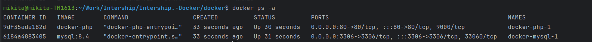

Task:

Добавьте резервное копирование и восстановление данных:

Используйте Docker Volume Snapshots для создания резервных копий данных приложения.
Восстановите данные из резервной копии в случае сбоя.

Требования:
ОС с установленым докером

Порядок выполнения: 
Запуск команд:

    cd ./docker
    docker compose up -d

Если все хорошо, то [тут](http://localhost:80) вас ждет запущенный сайт

Далее меняем что-либо в файле public/index.php

Определяем папку для хранения резервной копии. У меня это /home/mikita/Work/Intership/copy

Далее назодим hash контейнера нужного из всех коммандой

    docker ps -a

Пишем комманду для создания копии

    docker cp <container id>:/task3 <your path>_$(date +%Y%m%d%H%M%S)/
    Пример: docker cp 9df35ada182d:/task3 /home/mikita/Work/Intership/copy_$(date +%Y%m%d%H%M%S)/

Получаем сообщение об успешном выполнении

Меняем файл index.php, заходим на http://localhost и смотрим что бы были изменения

Теперь применяем комманду для восстановления 
    
    docker cp <path to copy> <container name>:/task3
    Пример: docker cp /home/mikita/Work/Intership/copy_20240509143254/index.php 9df35ada182d:/task3

Изменения сделаны